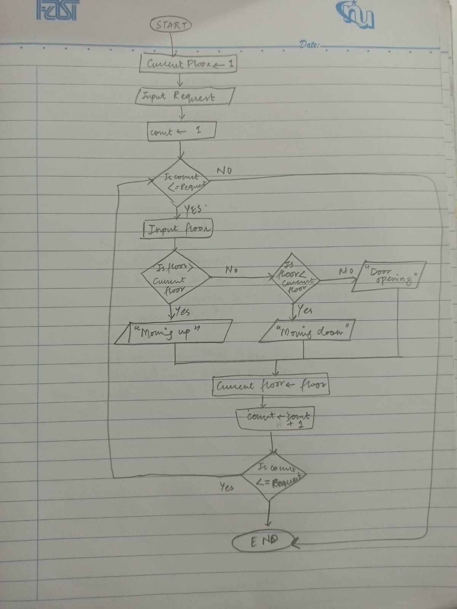

| **Input**                    | **Process**                                 | **Output**                    |
| ---------------------------- | ------------------------------------------- | ----------------------------- |
| Number of floor requests `N` | Set current floor = `0`                     | "Moving Up"                   |
| Each requested floor         | Compare requested floor with current floor  | "Moving Down"                 |
|                              | If requested floor > current floor          | "Doors Opening"               |
|                              | If requested floor < current floor          | Current floor after each stop |
|                              | If requested floor = current floor          |                               |
|                              | Update current floor to requested floor     |                               |
|                              | Repeat until all `N` requests are processed |                               |

